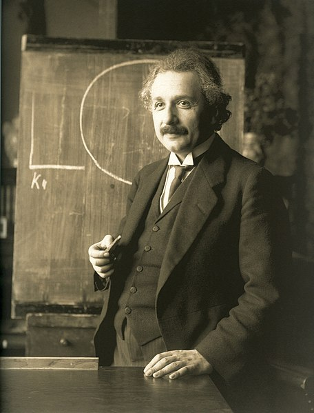

<table class="infobox biography vcard">
<tbody>
<tr>
<th colspan="2">

Albert Einstein

</th>
</tr>
<tr>
<td colspan="2">

Einstein in 1921

</td>
</tr>
<tr>
<th scope="row">Born</th>
<td>14 March 1879 

<a title="Ulm" href="https://en.wikipedia.org/wiki/Ulm">Ulm</a>,&nbsp;<a title="Kingdom of W&uuml;rttemberg" href="https://en.wikipedia.org/wiki/Kingdom_of_W%C3%BCrttemberg">Kingdom of W&uuml;rttemberg</a>,&nbsp;<a title="German Empire" href="https://en.wikipedia.org/wiki/German_Empire">German Empire</a>

</td>
</tr>
<tr>
<th scope="row">Died</th>
<td>18 April 1955&nbsp;(aged&nbsp;76) 

<a title="Princeton, New Jersey" href="https://en.wikipedia.org/wiki/Princeton,_New_Jersey">Princeton, New Jersey</a>, U.S.

</td>
</tr>
<tr>
<th scope="row">Citizenship</th>
<td class="category">

<ul>
<li><a title="Kingdom of W&uuml;rttemberg" href="https://en.wikipedia.org/wiki/Kingdom_of_W%C3%BCrttemberg">Kingdom of W&uuml;rttemberg</a>, part of the German Empire (1879&ndash;1896)</li>
<li><a title="Statelessness" href="https://en.wikipedia.org/wiki/Statelessness">Stateless</a>&nbsp;(1896&ndash;1901)</li>
<li><a title="Switzerland" href="https://en.wikipedia.org/wiki/Switzerland">Switzerland</a>&nbsp;(1901&ndash;1955)</li>
<li><a title="Cisleithania" href="https://en.wikipedia.org/wiki/Cisleithania">Austria</a>, part of the&nbsp;<a class="mw-redirect" title="Austro-Hungarian Empire" href="https://en.wikipedia.org/wiki/Austro-Hungarian_Empire">Austro-Hungarian Empire</a>&nbsp;(1911&ndash;1912)</li>
<li><a title="Kingdom of Prussia" href="https://en.wikipedia.org/wiki/Kingdom_of_Prussia">Kingdom of Prussia</a>, part of the German Empire (1914&ndash;1918)</li>
<li><a title="Free State of Prussia" href="https://en.wikipedia.org/wiki/Free_State_of_Prussia">Free State of Prussia</a>&nbsp;(<a title="Weimar Republic" href="https://en.wikipedia.org/wiki/Weimar_Republic">Weimar Republic</a>&nbsp;and&nbsp;<a title="Nazi Germany" href="https://en.wikipedia.org/wiki/Nazi_Germany">Nazi Germany</a>, 1918&ndash;1933)</li>
<li><a title="United States" href="https://en.wikipedia.org/wiki/United_States">United States</a>&nbsp;(1940&ndash;1955)</li>
</ul>

</td>
</tr>
<tr>
<th scope="row">Education</th>
<td>

<ul>
<li><a title="ETH Zurich" href="https://en.wikipedia.org/wiki/ETH_Zurich">Federal Polytechnic School</a>&nbsp;in&nbsp;<a class="mw-redirect" title="Zurich" href="https://en.wikipedia.org/wiki/Zurich">Zurich</a>&nbsp;(Federal teaching diploma, 1900)</li>
<li><a title="University of Zurich" href="https://en.wikipedia.org/wiki/University_of_Zurich">University of Zurich</a>&nbsp;(PhD, 1905)</li>
</ul>

</td>
</tr>
<tr>
<th scope="row">Known&nbsp;for</th>
<td>

<ul>
<li><a title="General relativity" href="https://en.wikipedia.org/wiki/General_relativity">General relativity</a></li>
<li><a title="Special relativity" href="https://en.wikipedia.org/wiki/Special_relativity">Special relativity</a></li>
<li><a title="Photoelectric effect" href="https://en.wikipedia.org/wiki/Photoelectric_effect">Photoelectric effect</a></li>
<li><a title="Mass&ndash;energy equivalence" href="https://en.wikipedia.org/wiki/Mass%E2%80%93energy_equivalence"><em>E=mc2</em>&nbsp;(Mass&ndash;energy equivalence)</a></li>
<li><a title="Planck&ndash;Einstein relation" href="https://en.wikipedia.org/wiki/Planck%E2%80%93Einstein_relation"><em>E=hf</em>&nbsp;(Planck&ndash;Einstein relation)</a></li>
<li>Theory of&nbsp;<a title="Brownian motion" href="https://en.wikipedia.org/wiki/Brownian_motion">Brownian motion</a></li>
<li><a title="Einstein field equations" href="https://en.wikipedia.org/wiki/Einstein_field_equations">Einstein field equations</a></li>
<li><a title="Bose&ndash;Einstein statistics" href="https://en.wikipedia.org/wiki/Bose%E2%80%93Einstein_statistics">Bose&ndash;Einstein statistics</a></li>
<li><a title="Bose&ndash;Einstein condensate" href="https://en.wikipedia.org/wiki/Bose%E2%80%93Einstein_condensate">Bose&ndash;Einstein condensate</a></li>
<li><a title="Gravitational wave" href="https://en.wikipedia.org/wiki/Gravitational_wave">Gravitational wave</a></li>
<li><a title="Cosmological constant" href="https://en.wikipedia.org/wiki/Cosmological_constant">Cosmological constant</a></li>
<li><a title="Unified field theory" href="https://en.wikipedia.org/wiki/Unified_field_theory">Unified field theory</a></li>
<li><a title="EPR paradox" href="https://en.wikipedia.org/wiki/EPR_paradox">EPR paradox</a></li>
<li><a title="Ensemble interpretation" href="https://en.wikipedia.org/wiki/Ensemble_interpretation">Ensemble interpretation</a></li>
<li><a title="List of things named after Albert Einstein" href="https://en.wikipedia.org/wiki/List_of_things_named_after_Albert_Einstein">List of other concepts</a></li>
</ul>

</td>
</tr>
<tr>
<th scope="row">Spouse(s)</th>
<td>

<a title="Mileva Marić" href="https://en.wikipedia.org/wiki/Mileva_Mari%C4%87">Mileva Marić</a>

&nbsp;

&nbsp;

(<abbr title="married">m.</abbr>&nbsp;1903;&nbsp;<abbr title="divorced">div.</abbr>&nbsp;1919)<wbr />

<a class="mw-redirect" title="Elsa L&ouml;wenthal" href="https://en.wikipedia.org/wiki/Elsa_L%C3%B6wenthal">Elsa L&ouml;wenthal</a>

&nbsp;

&nbsp;

(<abbr title="married">m.</abbr>&nbsp;1919; died&nbsp;1936)<wbr />

</td>
</tr>
<tr>
<th scope="row">Children</th>
<td>

<ul>
<li><a class="mw-redirect" title="Lieserl Einstein" href="https://en.wikipedia.org/wiki/Lieserl_Einstein">"Lieserl" Einstein</a></li>
<li><a title="Hans Albert Einstein" href="https://en.wikipedia.org/wiki/Hans_Albert_Einstein">Hans Albert Einstein</a></li>
<li><a title="Einstein family" href="https://en.wikipedia.org/wiki/Einstein_family#Eduard_%22Tete%22_Einstein_(Albert's_second_son)">Eduard "Tete" Einstein</a></li>
</ul>

</td>
</tr>
<tr>
<th scope="row">Awards</th>
<td>

<ul>
<li><a title="Barnard Medal for Meritorious Service to Science" href="https://en.wikipedia.org/wiki/Barnard_Medal_for_Meritorious_Service_to_Science">Barnard Medal</a>&nbsp;(1920)</li>
<li><a title="Nobel Prize in Physics" href="https://en.wikipedia.org/wiki/Nobel_Prize_in_Physics">Nobel Prize in Physics</a>&nbsp;(1921)</li>
<li><a title="Matteucci Medal" href="https://en.wikipedia.org/wiki/Matteucci_Medal">Matteucci Medal</a>&nbsp;(1921)</li>
<li><a class="mw-redirect" title="ForMemRS" href="https://en.wikipedia.org/wiki/ForMemRS">ForMemRS</a>&nbsp;(1921)</li>
<li><a title="Copley Medal" href="https://en.wikipedia.org/wiki/Copley_Medal">Copley Medal</a>&nbsp;(1925)</li>
<li><a title="Gold Medal of the Royal Astronomical Society" href="https://en.wikipedia.org/wiki/Gold_Medal_of_the_Royal_Astronomical_Society">Gold Medal of the Royal Astronomical Society</a>&nbsp;(1926)</li>
<li><a title="Max Planck Medal" href="https://en.wikipedia.org/wiki/Max_Planck_Medal">Max Planck Medal</a>&nbsp;(1929)</li>
<li><a title="Member of the National Academy of Sciences" href="https://en.wikipedia.org/wiki/Member_of_the_National_Academy_of_Sciences">Member of the National Academy of Sciences</a>&nbsp;(1942)</li>
<li><a title="Time 100: The Most Important People of the Century" href="https://en.wikipedia.org/wiki/Time_100:_The_Most_Important_People_of_the_Century"><em>Time</em>&nbsp;Person of the Century</a>&nbsp;(1999)</li>
</ul>

</td>
</tr>
<tr>
<td colspan="2"><strong>Scientific career</strong></td>
</tr>
<tr>
<th scope="row">Fields</th>
<td class="category"><a title="Physics" href="https://en.wikipedia.org/wiki/Physics">Physics</a>,&nbsp;<a title="Philosophy" href="https://en.wikipedia.org/wiki/Philosophy">philosophy</a></td>
</tr>
<tr>
<th scope="row">Institutions</th>
<td>

<ul>
<li><a class="mw-redirect" title="Swiss Patent Office" href="https://en.wikipedia.org/wiki/Swiss_Patent_Office">Swiss Patent Office</a>&nbsp;(<a title="Bern" href="https://en.wikipedia.org/wiki/Bern">Bern</a>) (1902&ndash;1909)</li>
<li><a title="University of Bern" href="https://en.wikipedia.org/wiki/University_of_Bern">University of Bern</a>&nbsp;(1908&ndash;1909)</li>
<li><a title="University of Zurich" href="https://en.wikipedia.org/wiki/University_of_Zurich">University of Zurich</a>&nbsp;(1909&ndash;1911)</li>
<li><a class="mw-redirect" title="Karl-Ferdinands-Universit&auml;t" href="https://en.wikipedia.org/wiki/Karl-Ferdinands-Universit%C3%A4t">Charles University in Prague</a>&nbsp;(1911&ndash;1912)</li>
<li><a title="ETH Zurich" href="https://en.wikipedia.org/wiki/ETH_Zurich">ETH Zurich</a>&nbsp;(1912&ndash;1914)</li>
<li><a title="Prussian Academy of Sciences" href="https://en.wikipedia.org/wiki/Prussian_Academy_of_Sciences">Prussian Academy of Sciences</a>&nbsp;(1914&ndash;1933)</li>
<li><a title="Humboldt University of Berlin" href="https://en.wikipedia.org/wiki/Humboldt_University_of_Berlin">Humboldt University of Berlin</a>&nbsp;(1914&ndash;1933)</li>
<li><a class="mw-redirect" title="Kaiser Wilhelm Institute" href="https://en.wikipedia.org/wiki/Kaiser_Wilhelm_Institute">Kaiser Wilhelm Institute</a>&nbsp;(director, 1917&ndash;1933)</li>
<li><a title="German Physical Society" href="https://en.wikipedia.org/wiki/German_Physical_Society">German Physical Society</a>&nbsp;(president, 1916&ndash;1918)</li>
<li><a title="Leiden University" href="https://en.wikipedia.org/wiki/Leiden_University">Leiden University</a>&nbsp;(visits, 1920)</li>
<li><a title="Institute for Advanced Study" href="https://en.wikipedia.org/wiki/Institute_for_Advanced_Study">Institute for Advanced Study</a>&nbsp;(1933&ndash;1955)</li>
<li><a class="mw-redirect" title="Caltech" href="https://en.wikipedia.org/wiki/Caltech">Caltech</a>&nbsp;(visits, 1931&ndash;1933)</li>
<li><a title="University of Oxford" href="https://en.wikipedia.org/wiki/University_of_Oxford">University of Oxford</a>&nbsp;(visits, 1931&ndash;1933)</li>
</ul>

</td>
</tr>
<tr>
<th scope="row"><a title="Thesis" href="https://en.wikipedia.org/wiki/Thesis">Thesis</a></th>
<td><a href="https://github.com/manjunath5496/The-Collected-Papers-of-Albert-Einstein/blob/main/al(14).pdf"><em>A New Determination of Molecular Dimensions</em>&nbsp;</a>(1905)</td>
</tr>
<tr>
<th scope="row"><a title="Doctoral advisor" href="https://en.wikipedia.org/wiki/Doctoral_advisor">Doctoral advisor</a></th>
<td><a title="Alfred Kleiner" href="https://en.wikipedia.org/wiki/Alfred_Kleiner">Alfred Kleiner</a></td>
</tr>
<tr>
<th scope="row">Other&nbsp;academic advisors</th>
<td><a title="Heinrich Friedrich Weber" href="https://en.wikipedia.org/wiki/Heinrich_Friedrich_Weber">Heinrich Friedrich Weber</a></td>
</tr>
<tr>
<th scope="row">Influences</th>
<td>

<ul>
<li><a title="Arthur Schopenhauer" href="https://en.wikipedia.org/wiki/Arthur_Schopenhauer">Arthur Schopenhauer</a></li>
<li><a title="Baruch Spinoza" href="https://en.wikipedia.org/wiki/Baruch_Spinoza">Baruch Spinoza</a></li>
<li><a title="Bernhard Riemann" href="https://en.wikipedia.org/wiki/Bernhard_Riemann">Bernhard Riemann</a></li>
<li><a title="David Hume" href="https://en.wikipedia.org/wiki/David_Hume">David Hume</a></li>
<li><a title="Ernst Mach" href="https://en.wikipedia.org/wiki/Ernst_Mach">Ernst Mach</a></li>
<li><a title="Hendrik Lorentz" href="https://en.wikipedia.org/wiki/Hendrik_Lorentz">Hendrik Lorentz</a></li>
<li><a title="Hermann Minkowski" href="https://en.wikipedia.org/wiki/Hermann_Minkowski">Hermann Minkowski</a></li>
<li><a title="Isaac Newton" href="https://en.wikipedia.org/wiki/Isaac_Newton">Isaac Newton</a></li>
<li><a title="James Clerk Maxwell" href="https://en.wikipedia.org/wiki/James_Clerk_Maxwell">James Clerk Maxwell</a></li>
<li><a title="Michele Besso" href="https://en.wikipedia.org/wiki/Michele_Besso">Michele Besso</a></li>
<li><a title="Moritz Schlick" href="https://en.wikipedia.org/wiki/Moritz_Schlick">Moritz Schlick</a></li>
<li><a title="Thomas Young (scientist)" href="https://en.wikipedia.org/wiki/Thomas_Young_(scientist)">Thomas Young</a></li>
</ul>

</td>
</tr>
<tr>
<th scope="row">Influenced</th>
<td>

<ul>
<li>Virtually all&nbsp;<a title="Modern physics" href="https://en.wikipedia.org/wiki/Modern_physics">modern physics</a></li>
</ul>

</td>
</tr>
<tr>
<th colspan="2">Signature</th>
</tr>
<tr>
<td colspan="2"></td>
</tr>
</tbody>
</table>

 

<strong> Publications: </strong>

<ul>

 <li><a target="_blank" href="https://github.com/manjunath5496/The-Collected-Papers-of-Albert-Einstein/blob/master/tst(5).pdf" style="text-decoration:none;">The Meaning of Relativity</a></li>
                            
 <li><a target="_blank" href="https://github.com/manjunath5496/The-Collected-Papers-of-Albert-Einstein/blob/master/tst(6).pdf" style="text-decoration:none;">The Evolution of Physics</a></li>

<li><a target="_blank" href="https://github.com/manjunath5496/The-Collected-Papers-of-Albert-Einstein/blob/master/tst(7).pdf" style="text-decoration:none;">Ideas and Opinions</a></li>
 <li><a target="_blank" href="https://github.com/manjunath5496/The-Collected-Papers-of-Albert-Einstein/blob/master/tst(8).pdf" style="text-decoration:none;">The World as I See It </a></li>                              

 <li><a target="_blank" href="https://github.com/manjunath5496/The-Collected-Papers-of-Albert-Einstein/blob/master/tst(9).pdf" style="text-decoration:none;">Out of My Later Years: The Scientist, Philosopher and Man Portrayed Through His Own Words</a></li>
                            
 <li><a target="_blank" href="https://github.com/manjunath5496/The-Collected-Papers-of-Albert-Einstein/blob/master/tst(10).pdf" style="text-decoration:none;">Relativity: The Special and the General Theory</a></li>

<li><a target="_blank" href="https://github.com/manjunath5496/The-Collected-Papers-of-Albert-Einstein/blob/master/tst(11).pdf" style="text-decoration:none;">On the electrodynamics of moving bodies</a></li>
 <li><a target="_blank" href="https://github.com/manjunath5496/The-Collected-Papers-of-Albert-Einstein/blob/master/tst(12).pdf" style="text-decoration:none;">The Collected Papers of Albert Einstein</a></li>                              

 <li><a target="_blank" href="https://github.com/manjunath5496/The-Collected-Papers-of-Albert-Einstein/blob/master/tst(212).pdf" style="text-decoration:none;">Fundamental ideas and problems of the theory of relativity [Nobel Lecture]</a></li>  
 

 <li><a target="_blank" href="https://github.com/manjunath5496/The-Collected-Papers-of-Albert-Einstein/blob/main/al(1).pdf" style="text-decoration:none;">Concerning an Heuristic Point of View Toward the Emission and Transformation of Light</a></li>

 <li><a target="_blank" href="https://github.com/manjunath5496/The-Collected-Papers-of-Albert-Einstein/blob/main/al(2).pdf" style="text-decoration:none;">Investigations on the theory of the Brownian movement</a></li>

<li><a target="_blank" href="https://github.com/manjunath5496/The-Collected-Papers-of-Albert-Einstein/blob/main/al(3).pdf" style="text-decoration:none;">On the Motion of Small Particles Suspended in Liquids at Rest Required by the Molecular-Kinetic Theory of Heat</a></li>
 <li><a target="_blank" href="https://github.com/manjunath5496/The-Collected-Papers-of-Albert-Einstein/blob/main/al(4).pdf" style="text-decoration:none;">Does the Inertia of a Body Depend upon its Energy-Content?</a></li>                              
<li><a target="_blank" href="https://github.com/manjunath5496/The-Collected-Papers-of-Albert-Einstein/blob/main/al(5).pdf" style="text-decoration:none;">Can Quantum-Mechanical Description of Physical Reality Be Considered Complete?</a></li>
<li><a target="_blank" href="https://github.com/manjunath5496/The-Collected-Papers-of-Albert-Einstein/blob/main/al(6).pdf" style="text-decoration:none;">Cosmological Considerations in the General Theory of Relativity</a></li>
 <li><a target="_blank" href="https://github.com/manjunath5496/The-Collected-Papers-of-Albert-Einstein/blob/main/al(7).pdf" style="text-decoration:none;">Quantum theory of the monoatomic ideal gas</a></li>

 <li><a target="_blank" href="https://github.com/manjunath5496/The-Collected-Papers-of-Albert-Einstein/blob/main/al(8).pdf" style="text-decoration:none;"> The Particle Problem in the General Theory of Relativity </a></li>
   <li><a target="_blank" href="https://github.com/manjunath5496/The-Collected-Papers-of-Albert-Einstein/blob/main/al(9).pdf" style="text-decoration:none;">Lens-Like Action of a Star by the Deviation of Light in the Gravitational Field</a></li>
  
   
 <li><a target="_blank" href="https://github.com/manjunath5496/The-Collected-Papers-of-Albert-Einstein/blob/main/al(10).pdf" style="text-decoration:none;">On the Method of Theoretical Physics</a></li>                              
<li><a target="_blank" href="https://github.com/manjunath5496/The-Collected-Papers-of-Albert-Einstein/blob/main/al(11).pdf" style="text-decoration:none;">On a Stationary System With Spherical Symmetry Consisting of Many Gravitating Masses</a></li>
<li><a target="_blank" href="https://github.com/manjunath5496/The-Collected-Papers-of-Albert-Einstein/blob/main/al(12).pdf" style="text-decoration:none;">Sidelights on Relativity</a></li>
<li><a target="_blank" href="https://github.com/manjunath5496/The-Collected-Papers-of-Albert-Einstein/blob/main/al(13).pdf" style="text-decoration:none;">On the Relation between the Expansion and the Mean Density of the Universe</a></li>
 
 
 
 

</ul>

 
